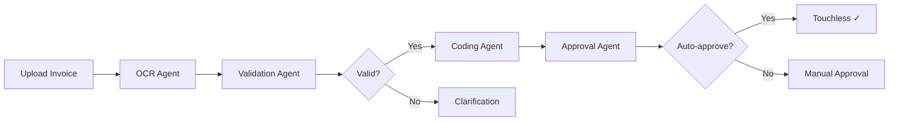

# PERFO AI - AI-Powered Accounts Payable Automation Platform


## 🚀 Overview

**PERFO AI** is an enterprise-grade, AI-powered platform for automating accounts payable (AP) processes. Using advanced LangGraph agents and Azure OpenAI, it processes invoices with 99%+ accuracy, automates validation, coding, and approval workflows.

### ✨ Key Features

- **🤖 Autonomous AI Agents**: 6 specialized agents using LangGraph for invoice processing
- **📄 Smart OCR**: 99%+ accuracy document extraction with Azure OpenAI
- **✅ Automated Validation**: Tax verification, fraud detection, PO matching
- **🎯 Intelligent Coding**: AI-powered GL account assignment
- **⚡ Touchless Processing**: 80-90% of invoices processed automatically
- **📊 Real-time Dashboard**: KPIs, metrics, and analytics
- **🔐 Role-based Access**: Admin, Finance Manager, Approver, Viewer roles
- **🐳 Docker Ready**: Complete containerized deployment

---

## 🏗️ Architecture

```
┌─────────────────────────────────────────────────────────┐
│                   PERFO AI Platform                      │
├─────────────────────────────────────────────────────────┤
│                                                           │
│  ┌──────────────┐    ┌──────────────┐    ┌───────────┐ │
│  │   Frontend   │───▶│   Backend    │───▶│ Database  │ │
│  │   React +    │    │  FastAPI +   │    │PostgreSQL │ │
│  │  TailwindCSS │    │  LangGraph   │    │           │ │
│  └──────────────┘    └──────────────┘    └───────────┘ │
│                              │                           │
│                              ▼                           │
│                    ┌──────────────────┐                 │
│                    │  AI Agents       │                 │
│                    │  ├─ OCR Agent    │                 │
│                    │  ├─ Validation   │                 │
│                    │  ├─ Coding       │                 │
│                    │  └─ Approval     │                 │
│                    └──────────────────┘                 │
│                              │                           │
│                              ▼                           │
│                    ┌──────────────────┐                 │
│                    │ Azure OpenAI     │                 │
│                    │ GPT-4.1          │                 │
│                    └──────────────────┘                 │
└─────────────────────────────────────────────────────────┘
```

---

## 📋 Prerequisites

Before you begin, ensure you have the following installed:

- **Docker** (version 20.10+)
- **Docker Compose** (version 2.0+)
- **Git**

That's it! Everything else runs inside Docker containers.

### Verify Docker Installation

```bash
docker --version
docker-compose --version
```

---

## 🚀 Quick Start Guide (For Beginners)

### Step 1: Clone the Repository

```bash
git clone <your-repo-url>
cd PerfoAI
```

### Step 2: Configure Environment Variables

The system comes pre-configured with Azure OpenAI credentials. No additional setup needed!

```bash
# Backend environment is already configured in backend/.env.example
# The system will use it automatically
```

### Step 3: Start the Application

This single command starts everything (database, backend, frontend):

```bash
docker-compose up --build
```

**What happens:**
- ✅ PostgreSQL database starts
- ✅ Redis cache starts
- ✅ Backend API starts on http://localhost:8000
- ✅ Frontend UI starts on http://localhost:3000
- ✅ Database is initialized with seed data

### Step 4: Access the Application

Open your browser and go to:

```
http://localhost:3000
```

### Step 5: Login with Demo Credentials

Use any of these accounts:

| Role             | Username         | Password      | Capabilities                    |
|------------------|------------------|---------------|---------------------------------|
| **Admin**        | `admin`          | `admin123`    | Full system access              |
| **Finance Mgr**  | `finance_manager`| `finance123`  | Invoice management              |
| **Approver**     | `approver`       | `approver123` | Approve/reject invoices         |
| **Viewer**       | `viewer`         | `viewer123`   | Read-only access                |

### Step 6: Explore the Platform

1. **Dashboard** - View KPIs and metrics
2. **Inbox** - Upload invoices (PDF, XML, images)
3. **Documents** - Search and manage all invoices
4. **Suppliers** - Manage vendor information

---

## 📊 Features Walkthrough

### 1. Dashboard

The main dashboard shows:

- **Incoming Invoices**: Total invoices in last 30 days
- **Touchless Bookings**: % of auto-processed invoices
- **Pending Clarifications**: Invoices needing attention
- **Days Payable Outstanding (DPO)**: Average payment days
- **Realized Cash Discounts**: Early payment savings
- **Invoice Cycle Time**: Average processing time

**Charts:**
- Weekly invoice processing trends
- Invoice status distribution
- Processing efficiency over time

### 2. Inbox (Invoice Upload & Processing)

**Upload an Invoice:**

1. Click **"Upload Invoice"** button
2. Select a PDF, XML, or image file
3. AI automatically:
   - Extracts all data (99%+ accuracy)
   - Validates taxes and amounts
   - Matches Purchase Orders
   - Assigns GL accounts
   - Determines approval requirements

**Processing Status:**

- ✅ **Completed**: Touchless, auto-approved
- 🟡 **Pending Approval**: Requires manager approval
- 🔴 **Pending Clarification**: Validation errors detected

### 3. Documents

Search and filter all invoices:

- Search by invoice number or supplier
- Filter by status (Approved, Pending, Rejected)
- View detailed invoice information
- Download documents
- Track processing history

### 4. AI Agents Workflow



**Agent Responsibilities:**

1. **OCR Agent**: Extracts invoice data using Azure OpenAI
2. **Validation Agent**: Validates taxes, PO, detects fraud
3. **Coding Agent**: Assigns GL accounts using AI
4. **Approval Agent**: Determines approval requirements

---

## 🐳 Docker Commands

### Start the Application

```bash
docker-compose up
```

### Start in Background

```bash
docker-compose up -d
```

### Stop the Application

```bash
docker-compose down
```

### View Logs

```bash
# All services
docker-compose logs -f

# Backend only
docker-compose logs -f backend

# Frontend only
docker-compose logs -f frontend
```

### Restart a Service

```bash
docker-compose restart backend
docker-compose restart frontend
```

### Rebuild After Code Changes

```bash
docker-compose up --build
```

### Reset Everything (Clean Start)

```bash
docker-compose down -v  # Removes volumes (database data)
docker-compose up --build
```

---

## 🗂️ Project Structure

```
PerfoAI/
├── backend/                    # Python FastAPI Backend
│   ├── app/
│   │   ├── agents/            # LangGraph AI Agents
│   │   │   ├── ocr_agent.py
│   │   │   ├── validation_agent.py
│   │   │   ├── coding_agent.py
│   │   │   ├── approval_agent.py
│   │   │   └── invoice_processor.py
│   │   ├── api/v1/            # API Endpoints
│   │   │   ├── auth.py
│   │   │   ├── invoices.py
│   │   │   └── suppliers.py
│   │   ├── core/              # Configuration & Security
│   │   ├── db/                # Database & Migrations
│   │   ├── models/            # SQLAlchemy Models
│   │   └── schemas/           # Pydantic Schemas
│   ├── Dockerfile
│   └── requirements.txt
│
├── frontend/                   # React Frontend
│   ├── src/
│   │   ├── components/        # Reusable Components
│   │   ├── pages/             # Page Components
│   │   │   ├── Dashboard.jsx
│   │   │   ├── Inbox.jsx
│   │   │   ├── Documents.jsx
│   │   │   └── Login.jsx
│   │   ├── services/          # API Client
│   │   ├── contexts/          # React Contexts
│   │   └── App.jsx
│   ├── Dockerfile
│   └── package.json
│
├── docker-compose.yml          # Docker Orchestration
└── README.md                   # This file
```

---

## 🔧 API Documentation

Once the backend is running, access interactive API docs:

- **Swagger UI**: http://localhost:8000/api/docs
- **ReDoc**: http://localhost:8000/api/redoc

### Key Endpoints

#### Authentication

```bash
POST /api/v1/auth/login
POST /api/v1/auth/register
GET  /api/v1/auth/me
```

#### Invoices

```bash
POST   /api/v1/invoices/upload        # Upload invoice
GET    /api/v1/invoices/              # List all invoices
GET    /api/v1/invoices/{id}          # Get invoice details
PUT    /api/v1/invoices/{id}          # Update invoice
POST   /api/v1/invoices/{id}/approve  # Approve invoice
POST   /api/v1/invoices/{id}/reject   # Reject invoice
GET    /api/v1/invoices/dashboard/metrics  # Dashboard metrics
```

#### Suppliers

```bash
POST   /api/v1/suppliers/             # Create supplier
GET    /api/v1/suppliers/             # List suppliers
GET    /api/v1/suppliers/{id}         # Get supplier
PUT    /api/v1/suppliers/{id}         # Update supplier
DELETE /api/v1/suppliers/{id}         # Delete supplier
```

---

## 🧪 Testing the System

### Upload a Test Invoice

1. Go to **Inbox** page
2. Click **"Upload Invoice"**
3. Upload a PDF invoice
4. Watch the AI process it in real-time
5. Check the result in the invoice card

### Expected Results

For a typical invoice with PO:

- ✅ **OCR Extraction**: 98%+ confidence
- ✅ **Validation**: Taxes verified, PO matched
- ✅ **Coding**: GL account assigned automatically
- ✅ **Status**: Touchless (if amount < $1,000)

---

## 💾 Database Access

### Connect to PostgreSQL

```bash
docker exec -it perfo-db psql -U perfo -d perfodb
```

### Useful SQL Queries

```sql
-- View all users
SELECT id, username, email, role FROM users;

-- View all invoices
SELECT invoice_number, total_amount, status, is_touchless FROM invoices;

-- View touchless rate
SELECT
  COUNT(*) as total,
  SUM(CASE WHEN is_touchless THEN 1 ELSE 0 END) as touchless,
  ROUND(100.0 * SUM(CASE WHEN is_touchless THEN 1 ELSE 0 END) / COUNT(*), 2) as touchless_rate
FROM invoices;
```

---

## 🛠️ Troubleshooting

### Problem: Port Already in Use

**Error**: `Port 8000 is already allocated`

**Solution**:
```bash
# Find and kill the process
lsof -ti:8000 | xargs kill -9
lsof -ti:3000 | xargs kill -9

# Or change ports in docker-compose.yml
```

### Problem: Database Connection Failed

**Solution**:
```bash
# Restart database
docker-compose restart db

# Check database health
docker-compose ps db
```

### Problem: Frontend Can't Connect to Backend

**Solution**:
Check the backend is running:
```bash
curl http://localhost:8000/health
```

### Problem: Need to Reset Database

**Solution**:
```bash
docker-compose down -v
docker-compose up --build
```

---

## 🔐 Security Notes

### For Production Deployment:

1. **Change SECRET_KEY** in `backend/.env.example`
   ```
   SECRET_KEY=generate-a-secure-random-string-min-32-chars
   ```

2. **Update Database Credentials**
   ```
   POSTGRES_PASSWORD=use-a-strong-password
   ```

3. **Configure CORS** in `backend/app/core/config.py`
   ```python
   BACKEND_CORS_ORIGINS = ["https://your-domain.com"]
   ```

4. **Use Environment Variables** for all secrets

---

## 📈 Performance Metrics

### Expected Performance

- **Invoice Processing**: < 3 seconds per invoice
- **OCR Accuracy**: 99%+
- **Touchless Rate**: 80-90%
- **API Response Time**: < 200ms

### Scaling

The system is designed to handle:

- **Small**: 100-500 invoices/month
- **Medium**: 500-5,000 invoices/month
- **Large**: 5,000+ invoices/month (with horizontal scaling)

---

## 🤝 Support

### Need Help?

1. Check this README
2. View API docs: http://localhost:8000/api/docs
3. Check Docker logs: `docker-compose logs -f`

### Common Issues

- **Login fails**: Check database initialized correctly
- **Upload fails**: Check file format (PDF, XML, PNG, JPG)
- **Slow processing**: Check Azure OpenAI API key is valid

---

## 📝 License

© 2024 PERFO AI. All rights reserved.

---

## 🎉 You're All Set!

Your PERFO AI platform is now running. Start uploading invoices and watch the AI agents work their magic!

**Quick Links:**
- 🌐 Frontend: http://localhost:3000
- 🔧 Backend API: http://localhost:8000
- 📚 API Docs: http://localhost:8000/api/docs

**Demo Login:**
- Username: `admin`
- Password: `admin123`

Happy automating! 🚀
